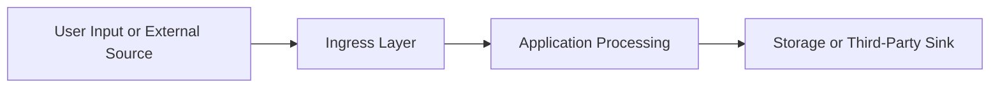

# {Project Name} — Audit Data Flow

> **Purpose**: Evidence-based data flow and privacy analysis covering trust boundaries, sensitive data movement, data sinks, and strict scoring.
> **Last Updated**: {YYYY-MM-DD}
> **Generated By**: docs-audit skill

---

## 📚 Table of Contents

- [1. Executive Summary](#1-executive-summary)
- [Evidence Sources](#evidence-sources)
- [2. Scope and Assumptions](#2-scope-and-assumptions)
- [3. Data Inventory](#3-data-inventory)
- [4. Data Flow Map](#4-data-flow-map)
- [5. Trust Boundaries and Sensitive Paths](#5-trust-boundaries-and-sensitive-paths)
- [6. Privacy Review](#6-privacy-review)
- [7. Score Summary](#7-score-summary)
- [Known Gaps and Open Questions](#known-gaps-and-open-questions)
- [Final Strict Score](#final-strict-score)

---

## 🏷️ Status Legend

- ✅ Verified: flow and controls are evidenced and traceable
- 🟡 Partial: evidence exists, but coverage or clarity is incomplete
- 🔴 Gap: risky or unmanaged data path
- ⚪ Unknown: insufficient evidence to determine data handling posture

## 📜 Document Contract

> [!IMPORTANT]
> Prioritize trust boundaries and sensitive-data paths before lower-risk flows.

- Prefer concise bullets for flow interpretation.
- Keep tables for inventory, key flows, and scoring only.
- Explicitly tag assumptions and unknowns.
- Never infer retention/consent controls without evidence.

---

## 🧭 1. Executive Summary

<!-- Describe what data appears to enter, move through, and leave the system, and where the main privacy risks or unknowns sit. -->

### Quick Read

- ✅ Known safe flow: {flow}
- 🟡 Partial visibility flow: {flow}
- 🔴 Highest-risk data path: {flow}
- ⚪ Unknown area: {flow}

### Section Output Contract

- [ ] Highest-risk data path identified
- [ ] Most important unknown disclosed
- [ ] One strong control signal highlighted

## 🔍 Evidence Sources

| File | Why it was used |
| ---- | ---------------- |
| `{path}#L{line}` | {evidence rationale} |

## 🧭 2. Scope and Assumptions

- Scope: {systems/modules/packages reviewed}
- Data categories covered: {user data, auth data, telemetry, uploaded files, etc.}
- Assumptions: {explicit non-verified assumptions}

## 🧭 3. Data Inventory

> [!NOTE]
> Classify data conservatively when sensitivity is unclear.

| Data Class | Sensitivity | Source | Storage or Sink | Notes |
| --- | --- | --- | --- | --- |
| {data class} | {Public/Internal/Sensitive/Highly Sensitive} | `{path}` | `{path or service}` | {notes} |

### 3.1 Sensitive Data Checklist

- [ ] Credentials/secrets flow identified
- [ ] PII entry points identified
- [ ] Third-party sinks identified
- [ ] Retention/deletion evidence identified

### 3.2 Trust-Boundary Checklist

- [ ] External ingress points identified
- [ ] Internal privilege transitions identified
- [ ] Third-party egress points identified

## 🧭 4. Data Flow Map

### 4.1 Key Flows

| Flow | Trigger | Path | Sensitive Data | Control Notes |
| --- | --- | --- | --- | --- |
| {flow name} | {trigger} | {component chain} | {yes/no + type} | {notes} |

## 🧭 5. Trust Boundaries and Sensitive Paths

- Boundary `{boundary}` crossing `{data crossing}`
    - Evidence: `{path}`
    - Risk: {risk}

## 🧭 6. Privacy Review

> [!WARNING]
> `⚪ Unknown` in privacy controls indicates assurance debt and must be tracked.

- Data minimization: `✅/🟡/🔴/⚪` — evidence `{path}` — {notes}
- Retention and deletion: `✅/🟡/🔴/⚪` — evidence `{path}` — {notes}
- Consent and transparency: `✅/🟡/🔴/⚪` — evidence `{path}` — {notes}
- Third-party sharing: `✅/🟡/🔴/⚪` — evidence `{path}` — {notes}
- Logging of sensitive data: `✅/🟡/🔴/⚪` — evidence `{path}` — {notes}

## 🧭 7. Score Summary

### Score Interpretation

- 90-100: clear dataflow observability and strong privacy posture
- 75-89: good baseline with moderate unknowns
- 60-74: fragmented visibility and partial controls
- <60: high uncertainty or unmanaged sensitive flows

| Dimension | Weight | Raw Score | Weighted Score | Notes |
| --- | --- | --- | --- | --- |
| Evidence quality | {weight} | {score} | {weighted} | {notes} |
| Data flow clarity | {weight} | {score} | {weighted} | {notes} |
| Sensitive-data hygiene | {weight} | {score} | {weighted} | {notes} |
| Privacy posture | {weight} | {score} | {weighted} | {notes} |
| Boundary awareness | {weight} | {score} | {weighted} | {notes} |

## ❓ Known Gaps and Open Questions

- {unknown area}

## 🧮 Final Strict Score

> [!IMPORTANT]
> Final score: **{0-100}** | Grade: **{A/B/C/D/E/F}** | Confidence: **{High/Medium/Low}**

- Score cap applied: {Yes/No + reason}
- Blocking issues: {list or none}
- What raises the score next:
    1. {concrete action}
    2. {concrete action}
    3. {concrete action}

Scoring rationale:
- {Explain the privacy and trust-boundary weaknesses holding the score down.}

Integrity check:
- Ensure no unresolved placeholders remain in this final file.