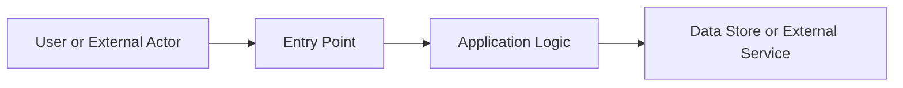

# {Project Name} — Audit Security

> **Purpose**: Evidence-based security assessment of the repository, including attack surface, control posture, findings, and strict scoring.
> **Last Updated**: {YYYY-MM-DD}
> **Generated By**: docs-audit skill

---

## 📚 Table of Contents

- [1. Executive Summary](#1-executive-summary)
- [Evidence Sources](#evidence-sources)
- [2. Audit Scope and Method](#2-audit-scope-and-method)
- [3. Attack Surface Overview](#3-attack-surface-overview)
- [4. Security Control Review](#4-security-control-review)
- [5. Findings Register](#5-findings-register)
- [6. Framework Mapping](#6-framework-mapping)
- [7. Score Summary](#7-score-summary)
- [Known Gaps and Open Questions](#known-gaps-and-open-questions)
- [Final Strict Score](#final-strict-score)

---

## 🏷️ Status Legend

- ✅ Verified: directly evidenced and reproducible from repository artifacts
- 🟡 Partial: evidence exists but implementation is incomplete or limited in scope
- 🔴 Gap: control is missing or materially insufficient
- ⚪ Unknown: insufficient evidence to conclude

## 📜 Document Contract

> [!IMPORTANT]
> Fill every section with evidence-backed statements only. If evidence is missing, use `⚪ Unknown` and explain the gap.

- Use concise paragraphs (2-4 lines) and prioritize bullets for decisions.
- Keep finding statements atomic: one issue, one impact, one recommendation.
- Keep `Findings Register`, `Framework Mapping`, and `Score Summary` as structured tables.
- Avoid speculative compliance/security claims.

---

## 🧭 1. Executive Summary

<!-- Summarize current posture in 3-6 sentences. State what was verified, what is risky, and what remains unknown. -->

### Quick Read

- ✅ Verified: {top confirmed control or strength}
- 🟡 Partial: {control that exists but is incomplete}
- 🔴 High Risk: {most urgent finding}
- ⚪ Unknown: {biggest evidence gap}

### Section Output Contract

- [ ] Posture summary is evidence-backed
- [ ] Top 1-2 risks are explicit
- [ ] Largest unknown area is explicit

## 🔍 Evidence Sources

| File | Why it was used |
| ---- | ---------------- |
| `{path}#L{line}` | {evidence rationale} |

## 🧭 2. Audit Scope and Method

- Scope: {services, apps, packages, folders covered}
- Audit mode: {CREATE / UPDATE}
- Methods used: {direct reads, targeted search, bootstrap scan, config review}
- Confidence constraints: {missing files, unknown runtime paths, incomplete evidence}

> [!NOTE]
> Security scoring should reflect only evidence-backed controls.

## 🧭 3. Attack Surface Overview

> [!NOTE]
> Document externally reachable and privilege-relevant paths first.

### 3.1 Exposed Entry Points

| Surface | Location | Exposure Type | Notes |
| --- | --- | --- | --- |
| {API / CLI / webhook / admin surface} | `{path}` | {internal/external/local} | {notes} |

### 3.2 Trust Boundary Diagram

## 🧭 4. Security Control Review

### 4.1 Control Status Checklist

- [ ] Authentication: `✅/🟡/🔴/⚪` — evidence: `{path}`
- [ ] Authorization: `✅/🟡/🔴/⚪` — evidence: `{path}`
- [ ] Input validation: `✅/🟡/🔴/⚪` — evidence: `{path}`
- [ ] Secrets handling: `✅/🟡/🔴/⚪` — evidence: `{path}`
- [ ] Session and cookie safety: `✅/🟡/🔴/⚪` — evidence: `{path}`
- [ ] Logging and auditability: `✅/🟡/🔴/⚪` — evidence: `{path}`
- [ ] Dependency hygiene: `✅/🟡/🔴/⚪` — evidence: `{path}`

### 4.2 Control Notes

- {control note 1}
- {control note 2}

## 🧭 5. Findings Register

> [!CAUTION]
> Every finding must map to at least one concrete evidence path.

| ID | Severity | Title | Evidence | Impact | Likelihood | Recommendation |
| --- | --- | --- | --- | --- | --- | --- |
| SEC-01 | {Critical/High/Medium/Low} | {finding} | `{path}` | {impact} | {likelihood} | {short action} |

## 🧭 6. Framework Mapping

| Finding or Control | OWASP Top 10 | ASVS | CWE | Notes |
| --- | --- | --- | --- | --- |
| {item} | {mapping} | {mapping} | {mapping} | {notes} |

> [!TIP]
> Keep mapping conservative. If uncertain, mark as `Unknown` instead of forcing a match.

## 🧭 7. Score Summary

### Score Interpretation

- 90-100: strong posture with minor gaps
- 75-89: acceptable baseline with important remediations pending
- 60-74: moderate risk, multiple partial controls
- <60: high-risk posture requiring immediate hardening

| Dimension | Weight | Raw Score | Weighted Score | Notes |
| --- | --- | --- | --- | --- |
| Evidence quality | {weight} | {score} | {weighted} | {notes} |
| Attack surface hygiene | {weight} | {score} | {weighted} | {notes} |
| Secure coding posture | {weight} | {score} | {weighted} | {notes} |
| Secret/configuration safety | {weight} | {score} | {weighted} | {notes} |
| Monitoring/auditability | {weight} | {score} | {weighted} | {notes} |

## ❓ Known Gaps and Open Questions

- {unknown area}

> [!WARNING]
> Unknowns are not neutral. They indicate missing assurance and should be planned as explicit follow-up work.

## 🧮 Final Strict Score

> [!IMPORTANT]
> Final score: **{0-100}** | Grade: **{A/B/C/D/E/F}** | Confidence: **{High/Medium/Low}**

- Score cap applied: {Yes/No + reason}
- Blocking issues: {list or none}
- What raises the score next:
    1. {concrete action}
    2. {concrete action}
    3. {concrete action}

Scoring rationale:
- {Short explanation for major deductions and the highest-priority next fix.}

Integrity check:
- Ensure no unresolved placeholders remain in this final file.