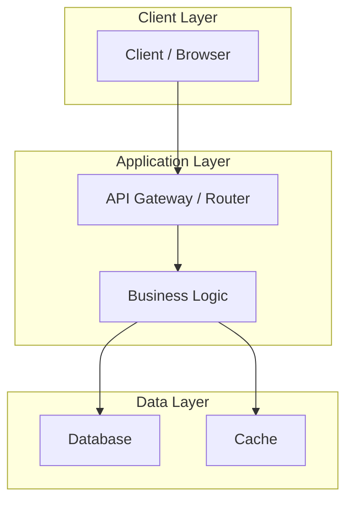
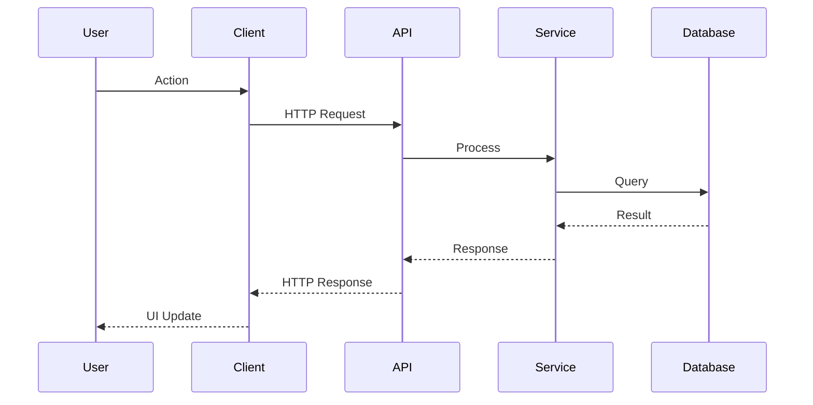
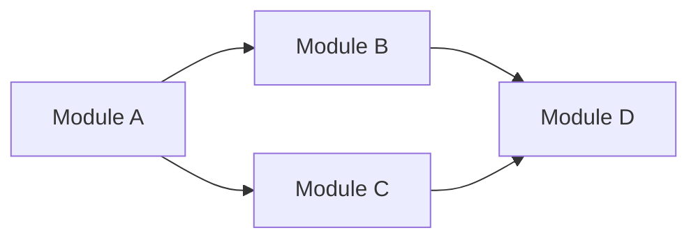

# {Project Name} — Knowledge Architecture

> **Purpose**: System design, component interactions, data flow, design patterns, and architectural decisions for AI agents and developers.
> **Last Updated**: {YYYY-MM-DD}
> **Generated By**: docs-core skill

---

## 📚 Table of Contents

- [1. System Overview](#1-system-overview)
- [Evidence Sources](#evidence-sources)
  - [1.1 High-Level Architecture](#11-high-level-architecture)
  - [1.2 Architecture Style](#12-architecture-style)
  - [1.3 Key Design Decisions](#13-key-design-decisions)
- [2. Core Components](#2-core-components)
  - [2.1 Component: {Name}](#21-component-name)
- [3. Data Flow](#3-data-flow)
  - [3.1 Request Lifecycle](#31-request-lifecycle)
  - [3.2 Key Data Flows](#32-key-data-flows)
- [4. Layer Architecture](#4-layer-architecture)
  - [4.1 Presentation Layer](#41-presentation-layer)
  - [4.2 Business Logic Layer](#42-business-logic-layer)
  - [4.3 Data Access Layer](#43-data-access-layer)
  - [4.4 Infrastructure Layer](#44-infrastructure-layer)
- [5. Design Patterns](#5-design-patterns)
- [6. Integration Points](#6-integration-points)
  - [6.1 Internal Integrations](#61-internal-integrations)
  - [6.2 External Integrations](#62-external-integrations)
- [7. Security Architecture](#7-security-architecture)
- [8. Dependency Map](#8-dependency-map)
  - [8.1 Runtime Dependencies](#81-runtime-dependencies)
  - [8.2 Development Dependencies](#82-development-dependencies)
  - [8.3 Dependency Graph](#83-dependency-graph)
- [9. Deployment Architecture](#9-deployment-architecture)
- [10. Onboarding Notes](#10-onboarding-notes)
- [11. Architectural Decisions Record (ADR)](#11-architectural-decisions-record-adr)
- [Known Gaps and Open Questions](#known-gaps-and-open-questions)

---

## 🧭 1. System Overview

## 🔍 Evidence Sources

<!--
  INSTRUCTIONS: List concrete files used for architecture claims.
-->

| File | Why it was used |
| ---- | ---------------- |
| `{path}` | {evidence rationale} |

---

### 1.1 High-Level Architecture

<!--
  INSTRUCTIONS: Create a text-based or Mermaid diagram showing
  the main components and their relationships.
  Show: User → Frontend → Backend → Database flow at minimum.
-->



### 1.2 Architecture Style

<!--
  INSTRUCTIONS: Identify the primary architecture pattern.
  Options: Monolith, Microservices, Serverless, Modular Monolith,
  Event-Driven, CQRS, Hexagonal, Clean, Layered, etc.
-->

| Aspect | Choice | Rationale |
| ------ | ------ | --------- |
| **Primary Pattern** | {pattern} | {why chosen} |
| **Communication** | {sync/async/hybrid} | {protocol} |
| **State Management** | {approach} | {where state lives} |

### 1.3 Key Design Decisions

| Decision | Choice | Alternative Considered | Rationale |
| -------- | ------ | --------------------- | --------- |
| {decision} | {chosen} | {alternative} | {why} |

---

## 🧭 2. Core Components

<!--
  INSTRUCTIONS: Document each major component/module.
  Repeat section 2.N for each component. Include:
  - Purpose, responsibilities, location, key files, public interface.
-->

### 2.1 Component: {Name}

| Attribute | Value |
| --------- | ----- |
| **Purpose** | {what it does} |
| **Location** | `{directory/}` |
| **Key Files** | `{file1}`, `{file2}` |
| **Depends On** | {other components} |
| **Depended By** | {who uses this} |

**Responsibilities**:
- {responsibility 1}
- {responsibility 2}

**Public Interface**:
```
{key exports, endpoints, or API methods}
```

<!--
  Repeat for each major component:
  ### 2.2 Component: {Name}
  ### 2.3 Component: {Name}
  ... etc.
-->

---

## 🧭 3. Data Flow

### 3.1 Request Lifecycle

<!--
  INSTRUCTIONS: Trace a typical request from user action to response.
  Use a Mermaid sequence diagram for complex flows.
-->



### 3.2 Key Data Flows

<!--
  INSTRUCTIONS: Document the most important data flows.
  Examples: Authentication flow, CRUD flow, real-time updates, file upload.
-->

| Flow | Trigger | Path | Outcome |
| ---- | ------- | ---- | ------- |
| {flow name} | {what triggers it} | {component chain} | {result} |

---

## 🧭 4. Layer Architecture

### 4.1 Presentation Layer

<!--
  INSTRUCTIONS: Include only layers that exist in the project.
  Remove sections for layers that don't apply.
-->

| Aspect | Detail |
| ------ | ------ |
| **Technology** | {framework} |
| **Location** | `{directory/}` |
| **Responsibilities** | UI rendering, user input, routing |
| **Communicates With** | Business Logic Layer via {method} |

### 4.2 Business Logic Layer

| Aspect | Detail |
| ------ | ------ |
| **Technology** | {framework/pattern} |
| **Location** | `{directory/}` |
| **Responsibilities** | Validation, business rules, orchestration |
| **Communicates With** | Data Access Layer via {method} |

### 4.3 Data Access Layer

| Aspect | Detail |
| ------ | ------ |
| **Technology** | {ORM/driver} |
| **Location** | `{directory/}` |
| **Responsibilities** | Database queries, caching, data transformation |
| **Communicates With** | Database, external APIs |

### 4.4 Infrastructure Layer

| Aspect | Detail |
| ------ | ------ |
| **Technology** | {tools} |
| **Location** | `{directory/}` |
| **Responsibilities** | Logging, monitoring, configuration, error handling |

---

## 🧭 5. Design Patterns

<!--
  INSTRUCTIONS: Document actual patterns found in code.
  Only include patterns that are actually implemented.
-->

| Pattern | Where Used | Implementation | Purpose |
| ------- | ---------- | -------------- | ------- |
| {pattern name} | `{file/module}` | {how implemented} | {why used} |

---

## 🧭 6. Integration Points

### 6.1 Internal Integrations

<!--
  INSTRUCTIONS: How components communicate internally.
  Include: module imports, event bus, shared state, IPC, etc.
-->

| From | To | Method | Data Format |
| ---- | -- | ------ | ----------- |
| {component} | {component} | {method} | {format} |

### 6.2 External Integrations

<!--
  INSTRUCTIONS: Third-party services and APIs the project uses.
-->

| Service | Purpose | Protocol | Auth Method |
| ------- | ------- | -------- | ----------- |
| {service} | {purpose} | {REST/GraphQL/gRPC} | {API key/OAuth/JWT} |

---

## 🧭 7. Security Architecture

<!--
  INSTRUCTIONS: Document the security model.
  Include authentication, authorization, data protection.
-->

| Aspect | Implementation |
| ------ | -------------- |
| **Authentication** | {method: JWT/Session/OAuth/API Key} |
| **Authorization** | {method: RBAC/ABAC/ACL} |
| **Data Encryption** | {at-rest and in-transit methods} |
| **Input Validation** | {library/approach} |
| **CORS Policy** | {configuration summary} |
| **Rate Limiting** | {approach if any} |

---

## 🧭 8. Dependency Map

### 8.1 Runtime Dependencies

| Package | Version | Purpose | Critical |
| ------- | ------- | ------- | -------- |
| {package} | {ver} | {purpose} | Yes/No |

### 8.2 Development Dependencies

| Package | Version | Purpose |
| ------- | ------- | ------- |
| {package} | {ver} | {purpose} |

### 8.3 Dependency Graph

<!--
  INSTRUCTIONS: Show how internal modules depend on each other.
  Use Mermaid if the graph has more than 5 nodes.
-->



---

## 🧭 9. Deployment Architecture

<!--
  INSTRUCTIONS: Document how the application is deployed.
  Include environments, hosting, CI/CD pipeline.
-->

| Environment | URL / Host | Purpose |
| ----------- | ---------- | ------- |
| Development | `localhost:{port}` | Local development |
| Staging | {url} | Pre-production testing |
| Production | {url} | Live users |

**Deployment Pipeline**:
```
Code Push → CI (lint + test) → Build → Deploy to {target}
```

---

## 🧭 10. Onboarding Notes

<!--
  INSTRUCTIONS: Give new members architecture-first guidance.
-->

- Start with the high-level architecture diagram and identify request path.
- Read one representative flow end-to-end (UI/API -> service -> data layer).
- Identify one critical dependency and one critical integration point.

---

## 🧭 11. Architectural Decisions Record (ADR)

<!--
  INSTRUCTIONS: Document significant decisions.
  Focus on choices already made (from code evidence), not recommendations.
-->

| ID | Decision | Date | Status | Context |
| -- | -------- | ---- | ------ | ------- |
| ADR-001 | {decision title} | {date} | Accepted | {why this decision was made} |

---

## ❓ Known Gaps and Open Questions

| Area | Gap / Question | Suggested Follow-up |
| ---- | -------------- | ------------------- |
| {area} | {what is unknown} | {who/what to check} |
