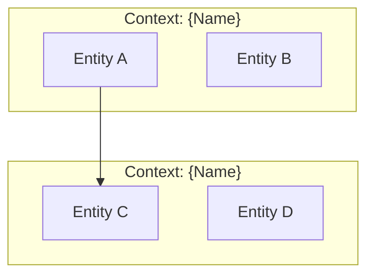
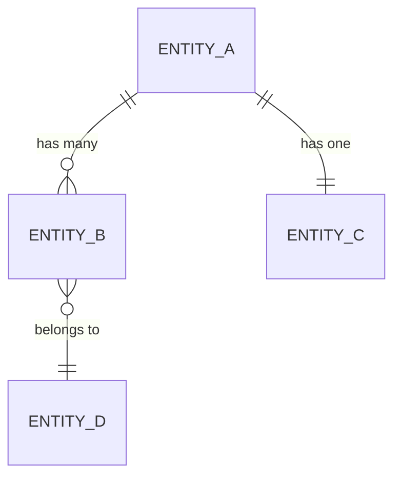
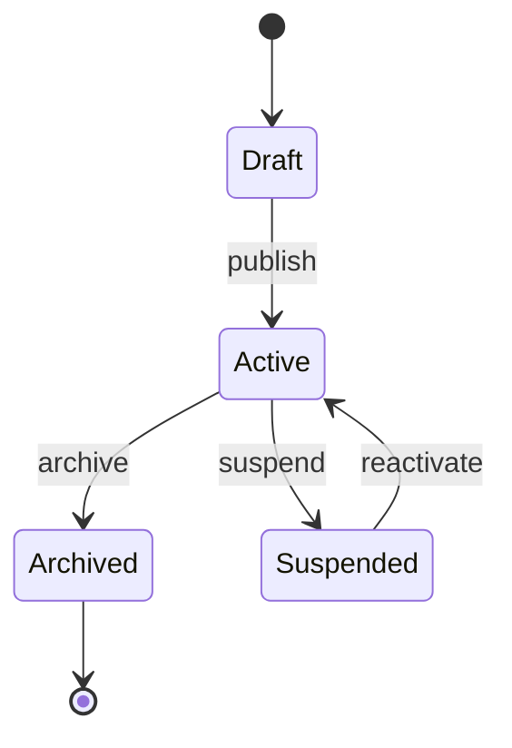
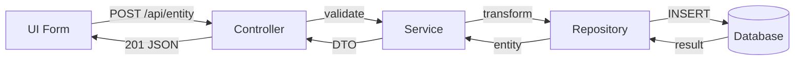

# {Project Name} — Knowledge Domain

> **Purpose**: Data models, database schema, API contracts, domain entities, and business rules for AI agents and developers.
> **Last Updated**: {YYYY-MM-DD}
> **Generated By**: docs-core skill

---

## 📚 Table of Contents

- [1. Domain Overview](#1-domain-overview)
- [Evidence Sources](#evidence-sources)
  - [1.1 Business Domain](#11-business-domain)
  - [1.2 Bounded Contexts](#12-bounded-contexts)
- [2. Core Entities](#2-core-entities)
  - [2.1 Entity: {Name}](#21-entity-name)
- [3. Entity Relationships](#3-entity-relationships)
  - [3.1 Relationship Diagram](#31-relationship-diagram)
  - [3.2 Relationship Matrix](#32-relationship-matrix)
- [4. Database Schema](#4-database-schema)
  - [4.1 Tables / Collections](#41-tables--collections)
  - [4.2 Indexes](#42-indexes)
  - [4.3 Migrations](#43-migrations)
- [5. API Contracts](#5-api-contracts)
  - [5.1 REST Endpoints](#51-rest-endpoints)
  - [5.2 GraphQL Schema](#52-graphql-schema)
  - [5.3 WebSocket Events](#53-websocket-events)
  - [5.4 Authentication](#54-authentication)
  - [5.5 Error Responses](#55-error-responses)
- [6. Data Transfer Objects (DTOs)](#6-data-transfer-objects-dtos)
  - [6.1 Request DTOs](#61-request-dtos)
  - [6.2 Response DTOs](#62-response-dtos)
- [7. Business Rules](#7-business-rules)
  - [7.1 Validation Rules](#71-validation-rules)
  - [7.2 Business Logic Rules](#72-business-logic-rules)
  - [7.3 State Machines](#73-state-machines)
- [8. Enumerations and Constants](#8-enumerations-and-constants)
- [9. Data Flow Maps](#9-data-flow-maps)
- [10. Onboarding Notes](#10-onboarding-notes)
- [Known Gaps and Open Questions](#known-gaps-and-open-questions)

---

## 🧭 1. Domain Overview

## 🔍 Evidence Sources

<!--
  INSTRUCTIONS: List concrete files used for domain/data claims.
-->

| File | Why it was used |
| ---- | ---------------- |
| `{path}` | {evidence rationale} |

---

### 1.1 Business Domain

<!--
  INSTRUCTIONS: Describe the business domain in plain language.
  What real-world problem does the data model serve?
  Who are the actors (users, admins, systems)?
-->

{Describe the business domain and primary actors.}

### 1.2 Bounded Contexts

<!--
  INSTRUCTIONS: Identify logical groupings of domain concepts.
  For monoliths: modules/folders. For microservices: services.
-->



| Context | Entities | Owner Module | Description |
| ------- | -------- | ------------ | ----------- |
| {context} | {entities} | `{module/}` | {description} |

---

## 🧭 2. Core Entities

<!--
  INSTRUCTIONS: Document each domain entity/model.
  Source from: ORM models, TypeScript interfaces, database schemas.
  Repeat section 2.N for each entity.
-->

### 2.1 Entity: {Name}

| Attribute | Value |
| --------- | ----- |
| **Source File** | `{path/to/model}` |
| **Database Table** | `{table_name}` |
| **Primary Key** | `{field}` ({type}) |

**Schema**:

| Field | Type | Required | Default | Description |
| ----- | ---- | -------- | ------- | ----------- |
| `{field}` | `{type}` | Yes/No | {default} | {description} |

**Validations**:
- `{field}`: {validation rule, e.g., "min 3, max 255 characters"}

**Timestamps**:
- `created_at`: Auto-generated on creation
- `updated_at`: Auto-updated on modification

<!--
  Repeat for each entity:
  ### 2.2 Entity: {Name}
  ### 2.3 Entity: {Name}
  ... etc.
-->

---

## 🧭 3. Entity Relationships

### 3.1 Relationship Diagram



### 3.2 Relationship Matrix

| From | To | Type | FK Field | Cascade |
| ---- | -- | ---- | -------- | ------- |
| {Entity A} | {Entity B} | One-to-Many | `{fk_field}` | {ON DELETE behavior} |

---

## 🧭 4. Database Schema

### 4.1 Tables / Collections

<!--
  INSTRUCTIONS: For SQL databases, document tables.
  For NoSQL, document collections and their document shape.
-->

| Table / Collection | Engine | Row Estimate | Description |
| ------------------ | ------ | ------------ | ----------- |
| `{table}` | {InnoDB/etc.} | {est. rows} | {purpose} |

### 4.2 Indexes

| Table | Index Name | Columns | Type | Purpose |
| ----- | ---------- | ------- | ---- | ------- |
| `{table}` | `{idx_name}` | `{col1, col2}` | {BTREE/HASH/GIN} | {why} |

### 4.3 Migrations

<!--
  INSTRUCTIONS: Document the migration strategy and current state.
-->

| Aspect | Detail |
| ------ | ------ |
| **Tool** | {Prisma Migrate / Alembic / Flyway / Knex / TypeORM} |
| **Location** | `{migrations/directory}` |
| **Naming** | `{convention: timestamp_description}` |
| **Current Count** | {N} migrations |

---

## 🧭 5. API Contracts

### 5.1 REST Endpoints

<!--
  INSTRUCTIONS: Document all REST API endpoints.
  Group by resource. Include method, path, auth, and description.
-->

#### Resource: {Name}

| Method | Path | Auth | Description | Request Body | Response |
| ------ | ---- | ---- | ----------- | ------------ | -------- |
| `GET` | `/api/{resource}` | {required/public} | List all | — | `{Resource}[]` |
| `GET` | `/api/{resource}/:id` | {required/public} | Get by ID | — | `{Resource}` |
| `POST` | `/api/{resource}` | {required} | Create | `Create{Resource}DTO` | `{Resource}` |
| `PUT` | `/api/{resource}/:id` | {required} | Update | `Update{Resource}DTO` | `{Resource}` |
| `DELETE` | `/api/{resource}/:id` | {required} | Delete | — | `204 No Content` |

### 5.2 GraphQL Schema

<!--
  INSTRUCTIONS: Include only if project uses GraphQL.
  Remove this section if REST-only.
-->

```graphql
type {Entity} {
  id: ID!
  field: String!
}

type Query {
  {entity}(id: ID!): {Entity}
  {entities}: [{Entity}!]!
}

type Mutation {
  create{Entity}(input: Create{Entity}Input!): {Entity}!
}
```

### 5.3 WebSocket Events

<!--
  INSTRUCTIONS: Include only if project uses WebSockets.
  Remove this section if not applicable.
-->

| Event | Direction | Payload | Description |
| ----- | --------- | ------- | ----------- |
| `{event}` | Client → Server | `{shape}` | {what it does} |
| `{event}` | Server → Client | `{shape}` | {what it does} |

### 5.4 Authentication

| Aspect | Detail |
| ------ | ------ |
| **Method** | {Bearer JWT / API Key / Session / OAuth2} |
| **Header** | `Authorization: Bearer {token}` |
| **Token Lifetime** | {duration} |
| **Refresh** | {mechanism} |

### 5.5 Error Responses

<!--
  INSTRUCTIONS: Document the standard error response format.
-->

```json
{
  "error": {
    "code": "{ERROR_CODE}",
    "message": "{Human-readable message}",
    "details": {}
  }
}
```

| HTTP Status | Code | Description |
| ----------- | ---- | ----------- |
| 400 | `VALIDATION_ERROR` | Invalid request body |
| 401 | `UNAUTHORIZED` | Missing or invalid credentials |
| 403 | `FORBIDDEN` | Insufficient permissions |
| 404 | `NOT_FOUND` | Resource does not exist |
| 500 | `INTERNAL_ERROR` | Unexpected server error |

---

## 🧭 6. Data Transfer Objects (DTOs)

### 6.1 Request DTOs

<!--
  INSTRUCTIONS: Document the shape of request bodies.
  Source from: Zod schemas, class-validator, Pydantic models, TypeScript types.
-->

**Create{Entity}DTO**:
| Field | Type | Required | Validation |
| ----- | ---- | -------- | ---------- |
| `{field}` | `{type}` | Yes/No | {rules} |

### 6.2 Response DTOs

**{Entity}Response**:
| Field | Type | Description |
| ----- | ---- | ----------- |
| `{field}` | `{type}` | {description} |

---

## 🧭 7. Business Rules

### 7.1 Validation Rules

| Entity | Field | Rule | Error |
| ------ | ----- | ---- | ----- |
| {Entity} | `{field}` | {rule description} | {error message} |

### 7.2 Business Logic Rules

<!--
  INSTRUCTIONS: Document non-trivial business logic.
  Focus on rules that might surprise a new developer.
-->

| Rule ID | Domain | Rule | Implementation |
| ------- | ------ | ---- | -------------- |
| BR-001 | {domain} | {rule in plain English} | `{file:function}` |

### 7.3 State Machines

<!--
  INSTRUCTIONS: Document entities that have state transitions.
  Include only if applicable (e.g., Order status, User lifecycle).
-->



| From State | To State | Trigger | Conditions | Side Effects |
| ---------- | -------- | ------- | ---------- | ------------ |
| {state} | {state} | {action} | {conditions} | {what happens} |

---

## 🧭 8. Enumerations and Constants

<!--
  INSTRUCTIONS: Document all enums, constants, and magic values.
  Source from: enum definitions, constants files, config.
-->

### {EnumName}

| Value | Label | Description |
| ----- | ----- | ----------- |
| `{VALUE}` | {Display Name} | {when used} |

---

## 🧭 9. Data Flow Maps

<!--
  INSTRUCTIONS: Trace data through the system for key operations.
  Show: UI → API → Service → Repository → DB path.
-->

### Flow: {Operation Name}



| Step | Component | Action | Data In | Data Out |
| ---- | --------- | ------ | ------- | -------- |
| 1 | {component} | {action} | {data shape} | {data shape} |

---

## 🧭 10. Onboarding Notes

<!--
  INSTRUCTIONS: Give a practical domain onboarding path.
-->

- Identify the top 3 core entities and their relationships.
- Trace one create/read/update/delete flow from API contract to persistence.
- Review one business rule with its implementation location.

---

## ❓ Known Gaps and Open Questions

| Area | Gap / Question | Suggested Follow-up |
| ---- | -------------- | ------------------- |
| {area} | {what is unknown} | {who/what to check} |
