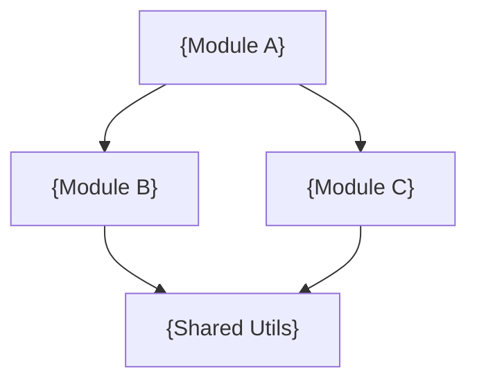

# {Project Name} — Knowledge Source Base

> **Purpose**: Directory structure, file purposes, entry points, key modules, and code organization for AI agents and developers.
> **Last Updated**: {YYYY-MM-DD}
> **Generated By**: docs-core skill

---

## 📚 Table of Contents

- [1. Project Root Structure](#1-project-root-structure)
- [Evidence Sources](#evidence-sources)
- [2. Directory Breakdown](#2-directory-breakdown)
  - [2.1 {Directory Name}](#21-directory-name)
- [3. Entry Points](#3-entry-points)
  - [3.1 Application Entry Points](#31-application-entry-points)
  - [3.2 Build Entry Points](#32-build-entry-points)
  - [3.3 Configuration Entry Points](#33-configuration-entry-points)
- [4. Key Files Reference](#4-key-files-reference)
- [5. Module Breakdown](#5-module-breakdown)
  - [5.1 Module: {Name}](#51-module-name)
- [6. File Naming Conventions](#6-file-naming-conventions)
- [7. Import / Dependency Map](#7-import--dependency-map)
- [8. Build Artifacts](#8-build-artifacts)
- [9. Onboarding Notes](#9-onboarding-notes)
  - [9.1 Read Order for New Members](#91-read-order-for-new-members)
- [Known Gaps and Open Questions](#known-gaps-and-open-questions)

---

## 🧭 1. Project Root Structure

## 🔍 Evidence Sources

<!--
  INSTRUCTIONS: List concrete files and commands used for source-map claims.
-->

| Source | Why it was used |
| ------ | ---------------- |
| `{path-or-command}` | {evidence rationale} |

---

<!--
  INSTRUCTIONS: Show the complete top-level directory tree.
  Use icon prefixes to indicate folder purpose.
  Include only directories and root-level config files.
-->

```
{project-name}/
├── {dir}/                           # {emoji} {Short description}
├── {dir}/                           # {emoji} {Short description}
├── {config-file}                    # {emoji} {Short description}
├── package.json                     # 📦 Dependencies and scripts
├── README.md                        # 📖 Project documentation
└── ...
```

---

## 🧭 2. Directory Breakdown

<!--
  INSTRUCTIONS: Document each directory with its contents and purpose.
  Show the internal file tree (depth 2-3) for important directories.
  Repeat section 2.N for each major directory.
-->

### 2.1 `{directory}/` — {Short Description}

{One paragraph explaining this directory's role in the system.}

```
{directory}/
├── {file-or-subdir}                 # {purpose}
├── {file-or-subdir}                 # {purpose}
└── {file-or-subdir}                 # {purpose}
```

| File / Subdirectory | Type | Purpose |
| ------------------- | ---- | ------- |
| `{name}` | {file/dir} | {detailed purpose} |

<!--
  Repeat for each major directory:
  ### 2.2 `{directory}/` — {Short Description}
  ### 2.3 `{directory}/` — {Short Description}
  ... etc.
-->

---

## 🧭 3. Entry Points

### 3.1 Application Entry Points

<!--
  INSTRUCTIONS: Identify the files that start the application.
  These are the first files executed when the app runs.
-->

| Entry Point | File | Purpose | Command |
| ----------- | ---- | ------- | ------- |
| Main Application | `{path}` | {what it bootstraps} | `{npm start / python main.py / etc.}` |
| Dev Server | `{path}` | {dev mode startup} | `{npm run dev}` |
| Worker / Background | `{path}` | {background processes} | `{command}` |

### 3.2 Build Entry Points

| Entry Point | File | Purpose |
| ----------- | ---- | ------- |
| Build Config | `{path}` | {webpack/vite/rollup/tsc config} |
| Output Directory | `{path}/` | {where builds go} |

### 3.3 Configuration Entry Points

| File | Loaded By | Purpose |
| ---- | --------- | ------- |
| `{config-file}` | {what reads it} | {what it configures} |

---

## 🧭 4. Key Files Reference

<!--
  INSTRUCTIONS: List the most important files a new developer
  should read first to understand the project.
  Order by importance / recommended reading order.
-->

| Priority | File | Purpose | Read When |
| -------- | ---- | ------- | --------- |
| 🔴 Critical | `{path}` | {purpose} | First day |
| 🟠 High | `{path}` | {purpose} | First week |
| 🟡 Medium | `{path}` | {purpose} | As needed |

---

## 🧭 5. Module Breakdown

<!--
  INSTRUCTIONS: Document logical modules (may span directories).
  Focus on how the codebase is organized conceptually.
  Repeat section 5.N for each module.
-->

### 5.1 Module: {Name}

| Attribute | Value |
| --------- | ----- |
| **Location** | `{directory/}` |
| **Purpose** | {what this module handles} |
| **Key Files** | {list of important files} |
| **Exports** | {main exports used by other modules} |
| **Dependencies** | {other modules it imports from} |

**File Inventory**:

| File | Lines | Purpose |
| ---- | ----- | ------- |
| `{filename}` | ~{N} | {specific purpose} |

<!--
  Repeat for each module:
  ### 5.2 Module: {Name}
  ### 5.3 Module: {Name}
  ... etc.
-->

---

## 🧭 6. File Naming Conventions

<!--
  INSTRUCTIONS: Document patterns observed in the codebase.
-->

| Pattern | Convention | Examples |
| ------- | ---------- | -------- |
| Components | {PascalCase / kebab-case} | `{example}` |
| Utilities | {pattern} | `{example}` |
| Tests | {pattern} | `{example}` |
| Styles | {pattern} | `{example}` |
| Types | {pattern} | `{example}` |
| Config | {pattern} | `{example}` |

---

## 🧭 7. Import / Dependency Map

<!--
  INSTRUCTIONS: Show how modules depend on each other.
  Use a table or Mermaid graph for visualization.
-->



| Module | Imports From | Imported By |
| ------ | ------------ | ----------- |
| `{module}` | `{dependencies}` | `{dependents}` |

---

## 🧭 8. Build Artifacts

<!--
  INSTRUCTIONS: Document what the build process produces.
-->

| Artifact | Location | Format | Purpose |
| -------- | -------- | ------ | ------- |
| {artifact} | `{path}/` | {format} | {purpose} |

**Ignored Paths** (from `.gitignore`):
- `{path}/` — {why ignored}

---

## 🧭 9. Onboarding Notes

### 9.1 Read Order for New Members

<!--
  INSTRUCTIONS: Provide exact file reading order with intent.
-->

1. `{file}` — Understand purpose and boundaries.
2. `{file}` — Understand runtime entry and bootstrapping.
3. `{directory}/` — Understand business/domain modules.
4. `{file}` — Understand tests and expected behavior.
5. `{file}` — Understand standards and contribution rules.

---

## ❓ Known Gaps and Open Questions

| Area | Gap / Question | Suggested Follow-up |
| ---- | -------------- | ------------------- |
| {area} | {what is unknown} | {who/what to check} |
